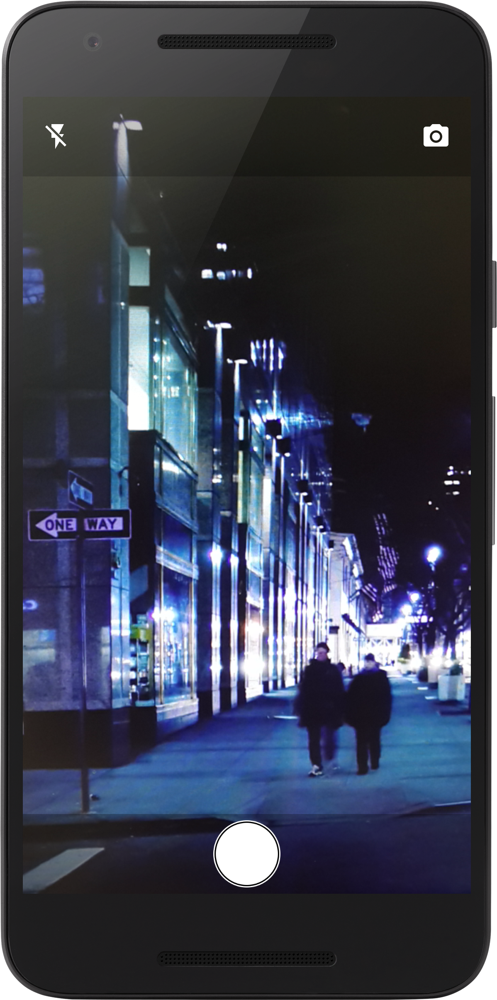
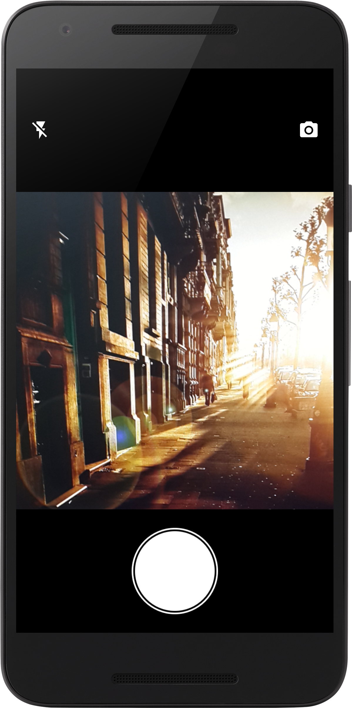
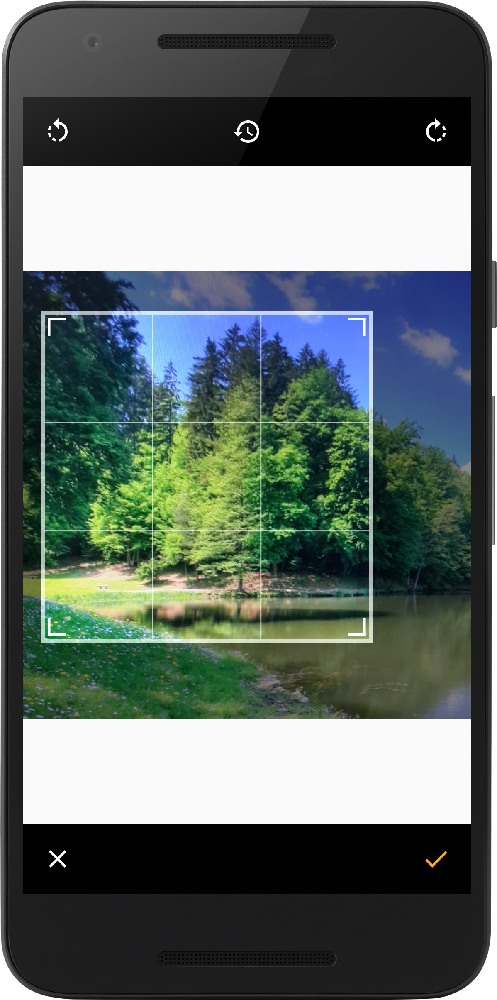
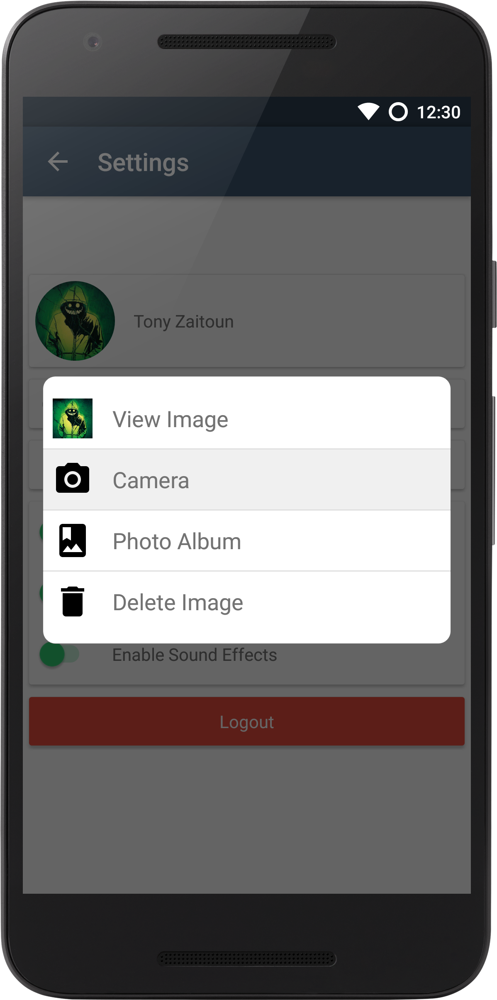

Installation Instructions
------

####JCenter

Add this line to your dependencies if you are using JCenter:
```groovy
    compile 'net.crofis:ui:1.0.1'
```

####Maven Central

Add this in your project build.gradle:
```groovy
repositories {
    maven {
        url 'https://dl.bintray.com/minitour/maven/'
    }
}
 
```
And add this in your app module build.gradle.
 ```groovy
dependencies {
    compile 'net.crofis:ui:1.0.1'
}
```
JCenter() installation coming soon!


Camera Kit
------

####Normal Camera:

```java
import net.crofis.ui.camera.CameraActivity;
```
```java
    CameraActivity.activity()
                  .setCropOptional(true)
                  .showZoomBar(false)
                  .saveFileToStorage(true)
                  .setCropAspectRatio(4,3)
                  .openWithCamera(1)
                  .start(this);
```

####Square Camera:

```java
import net.crofis.ui.camera.SquareCameraActivity;
```
```java
    SquareCameraActivity.activity()
                        .displayFlashToggle(true)
                        .displayCameraSwitchToggle(true)
                        .setCropOptional(true)
                        .setCropAspectRatio(1,1)
                        .start(this);
```

Dialog Kit
------

####Loading Dialog
This dialog makes use of the [SmoothProgressBar](https://github.com/castorflex/SmoothProgressBar) library by [castorflex](https://github.com/castorflex).


**Usage:**
```java
    final LoadingDialog dialog = new LoadingDialog(MainActivity.this,"Loading...");
    dialog.show();
```

And when ready to dismiss you can use one of the following:
```java
//Dismiss with animation.
dialog.complete(true);
```
Or
```java
    //Dismiss without waiting for the progress bar to finish the animation.
    dialog.dismiss();
```
And to display a message on the dialog use the following method:
```java
    /**
     * .complete() method is used to stop the progress bar (call "finish loading" animation)
     *
     * @param autoDismiss - whether the dialog should dismiss after calling .complete().
     * @param isPositive - if the button that will be dismissed will look postive (Green) or negative (red).
     * @param newTitle - the new title that will be shown after .complete() is called, will be ignored if autoDismiss is true.
     * @param newMsg - the new message that will be shown after .complete() is called, will be ignored if autoDismiss is true.
     */
    public void complete(final boolean autoDismiss,final boolean isPositive,final String newTitle,final String newMsg);
```
####Action Dialog
This dialog was inspired by the iOS [UIAlertController](https://developer.apple.com/library/ios/documentation/UIKit/Reference/UIAlertController_class/) class. And its main usage is to present a ListView with custom actions inside a dialog. I made this dialog because I simply needed a dialog that can hold more than 3 buttons, So now I can have as many as I want. Note that even if the list view exceeds the screen's limit, there is the built in ScrollView that comes with the ListView. Another important thing to note is that I made this as dynamic as possible, so other developers can also create their own custom action items.



**Usage:**
```java
    import net.crofis.ui.custom.actionitem.ActionItem;
    import net.crofis.ui.custom.actionitem.ActionItemClickListener;
    import net.crofis.ui.dialog.ActionDialog;
```
```java
    //First we have to create the list that will contain the action items
    List <ActionItem> items = new ArrayList<>();
    
    //Fill the list with our desired actions
    Drawable icon = getResources().getDrawable(R.drawable.common_ic_googleplayservices);
    for (int i = 0; i < 4; i++) {
        final int finalI = i;
        
        //Create the action item with constructor ActionItem(Drawable,String, ActionItemClickListner);
        ActionItem item = new ActionItem(icon, "item " + (i + 1), new ActionItemClickListener() {
            @Override
            public void onActionSelected() {
                //This is what will be triggered when the action is selected.
                Toast.makeText(MainActivity.this,"item "+(finalI +1)+" selected.",Toast.LENGTH_SHORT).show();
            }
        });
      items.add(item);
    }
    
    //Create the ActionDialog object with constuctor ActionDialog(Context,List<ActionItem>)
    final ActionDialog dialog = new ActionDialog(this, items);
    
    //Optionl customization - set the gravity of the dialog (TOP or BOTTOM)
    //Must import net.crofis.ui.dialog.DialogManager;
    DialogManager.setDialogPosition(dialog,dialog.getDialog(), Gravity.BOTTOM);
    
    //Set the text - if not set, the TextViews will disappear.
    dialog.setDialogTitle("Select Action");
    dialog.setDialogDescription("Select an action to close the dialog.");
    
    //Finall, show the dialog
    dialog.show();
```
####Info Dialog
Documentation and Usage examples coming soon!

####Message Dialog
Documentation and Usage examples coming soon!

####Camera Dialog
Still a work in progress.

####Custom View Dialog
Documentation and Usage examples coming soon!


